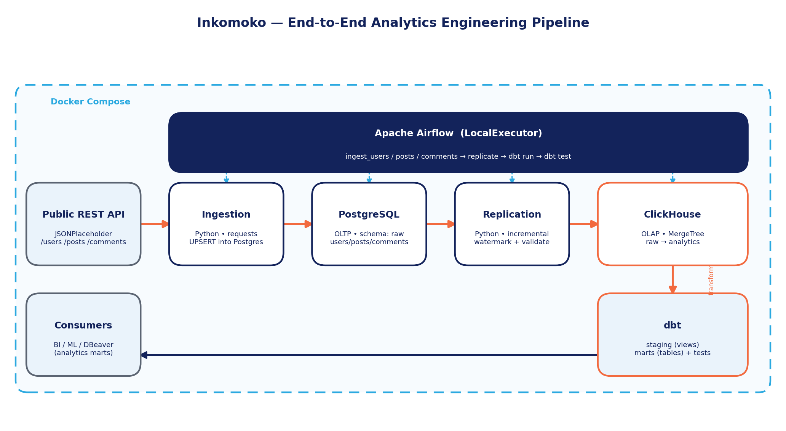

# Design Report — Inkomoko Analytics Engineering Pipeline



## 1. Architecture overview

The pipeline follows a modern **ELT** (Extract, Load, Transform) pattern with a
clear separation between the **operational (OLTP)** and **analytical (OLAP)**
tiers, transformation handled in-warehouse by dbt, and orchestration by Airflow.
Everything is containerised with Docker Compose so the entire platform stands up
with one command.

Layers:

1. **Source** — JSONPlaceholder public REST API (`/users`, `/posts`,
   `/comments`). No authentication required.
2. **Ingestion (Python)** — pulls each endpoint with retry/backoff and UPSERTs
   flattened rows into PostgreSQL's `raw` schema. Idempotent on primary key.
3. **OLTP store (PostgreSQL)** — the system of record for ingested data; also
   hosts Airflow's metadata database.
4. **Replication (Python)** — incrementally copies new/changed rows from
   PostgreSQL into ClickHouse using a per-table watermark, then validates
   row counts on both sides.
5. **OLAP store (ClickHouse)** — columnar warehouse holding `raw` landing
   tables and the dbt-built `analytics` database.
6. **Transformation (dbt)** — `staging` models clean/standardise/de-duplicate;
   `marts` produce analytics- and ML-ready aggregates. Data-quality tests
   (not-null, unique, relationships) enforce correctness.
7. **Orchestration (Airflow)** — a single DAG runs ingestion → replication →
   dbt run → dbt test with retries, backoff, and a failure-alert hook.

## 2. Data flow

```
API ──GET──▶ Ingestion ──UPSERT──▶ Postgres.raw.{users,posts,comments}
                                        │
                          incremental (ingested_at > watermark)
                                        ▼
                         ClickHouse.raw.{users,posts,comments}   (ReplacingMergeTree)
                                        │  dbt run
                                        ▼
                         ClickHouse.analytics.stg_*  (views, de-duplicated)
                                        │
                                        ▼
                         ClickHouse.analytics.mart_*  (MergeTree tables)
                                        │  dbt test
                                        ▼
                                  BI / ML / DBeaver
```

The two marts:

* **`mart_user_post_summary`** — one row per user: posts authored, comments
  received on those posts, unique commenters, and average post lengths.
* **`mart_comment_statistics`** — one row per post: comment volume, unique
  commenters, and comment-length distribution, joined to the author.

## 3. OLTP vs OLAP

### Purpose
OLTP (PostgreSQL):
Designed for operational reads and writes and serves as the system of record for the application. It stores raw data and supports day-to-day transactional activities.

OLAP (ClickHouse):
Designed for analytical processing and aggregation over large volumes of data. It enables fast reporting, dashboarding, and analytical workloads.

### Workload
OLTP (PostgreSQL):
Handles many small transactions such as inserts, updates, deletes, and point lookups. These operations typically affect a small number of records at a time.

OLAP (ClickHouse):
Handles fewer but much larger queries involving GROUP BY operations, aggregations, time-series analysis, and large table scans.

### Storage
OLTP (PostgreSQL):
Uses row-oriented storage, where all values belonging to a record are stored together. This approach is efficient for transactional operations that frequently access complete records.

OLAP (ClickHouse):
Uses column-oriented storage, where values from the same column are stored together. This allows only the required columns to be scanned, resulting in higher compression and significantly faster analytical queries.

### Consistency
OLTP (PostgreSQL):
Provides strong ACID transaction guarantees, ensuring high levels of data integrity, reliability, and consistency.

OLAP (ClickHouse):
Uses eventual consistency during background merge operations and is optimized primarily for high read throughput and analytical performance.

### Indexing
OLTP (PostgreSQL):
Relies on B-tree indexes and other indexing structures to accelerate transactional queries and key-based lookups.

OLAP (ClickHouse):
Uses a sparse primary index based on the table's sorting key (ORDER BY) to efficiently skip irrelevant data blocks during large analytical scans.

Keeping the two separate means heavy analytical queries never contend with
operational writes, and each engine is used where it is strongest. This mirrors
the real-world separation between application databases and analytical
warehouses.

## 4. Why PostgreSQL and ClickHouse

**PostgreSQL (OLTP):** mature, reliable, ACID-compliant relational database;
excellent for a normalised system of record, with rich SQL, robust constraints,
strong tooling (DBeaver, psql), and a natural fit as Airflow's metadata store —
so one engine covers both application data and orchestration metadata.

**ClickHouse (OLAP):** purpose-built columnar warehouse optimised for analytical
scans and aggregations. Its `MergeTree` family gives high compression, a sparse
primary index driven by the `ORDER BY` key, and very fast `GROUP BY`/aggregate
performance — exactly what the staging-and-mart workload needs. The assessment
explicitly calls for ClickHouse-optimised modelling, which the marts honour by
materialising as `MergeTree` tables ordered by their grain key.

### ClickHouse engine notes

* **MergeTree** is the core engine family: data is stored sorted by the
  `ORDER BY` key in immutable parts that merge in the background. The sort key
  doubles as a sparse **primary index**, so range/lookup queries on that key
  skip most of the data.
* **`ORDER BY` (ordering/sorting key)** determines on-disk layout and the
  primary index. We order landing and mart tables by their natural grain
  (`id`), which accelerates joins and lookups.
* **ReplacingMergeTree(`ingested_at`)** is used for the `raw` landing tables: on
  merge it keeps only the latest row per sorting key (by the `ingested_at`
  version column). Combined with the replication watermark, this makes
  re-loading the same record idempotent — critical for safe retries.

## 5. Reliability & data quality

* **Idempotency everywhere:** Postgres UPSERT on PK; ClickHouse
  ReplacingMergeTree de-duplication; dbt models are deterministic rebuilds.
* **Incremental replication:** a watermark per table moves only new rows,
  keeping the design ready to scale beyond a static demo dataset.
* **Validation:** the replication step compares Postgres vs ClickHouse counts
  (`FINAL`) and fails loudly on mismatch.
* **Tests:** dbt enforces `not_null`, `unique`, and `relationships` across
  staging and marts, so referential integrity is checked on every run.
* **Orchestration safety:** retries with exponential backoff and a failure
  callback (ready to wire to Slack/email/PagerDuty).

---

## 6. Scaling the pipeline (future volume)

The current dataset is tiny (610 rows). The architecture is deliberately shaped
so the *pattern* scales; here is how each layer evolves with volume.

### At ~10 million records/day

* **Ingestion → streaming.** Replace single-shot REST pulls with an event
  stream. Introduce **Apache Kafka** as a durable buffer: producers write raw
  events to topics; consumers load to storage. This decouples source spikes
  from downstream processing and enables replay.
* **Loading.** Move from row-by-row UPSERT to **batch/micro-batch** loads
  (COPY into Postgres, native bulk insert into ClickHouse). Partition large
  tables by date.
* **Replication.** Switch the watermark approach to log-based **Change Data
  Capture** (e.g. Debezium reading the Postgres WAL into Kafka), so ClickHouse
  is fed a continuous changelog rather than periodic table scans.
* **Transformation.** dbt incremental models (only process new partitions)
  instead of full rebuilds; ClickHouse partitioning + `ORDER BY` tuning and
  materialised views for hot aggregates.
* **Orchestration.** Airflow with a real executor (Celery/Kubernetes) and
  sensor-/event-driven triggers rather than fixed schedules.

### At ~100 million records/day

* **Decoupled storage — S3 data lake.** Land raw/immutable data in object
  storage (**S3**/GCS/MinIO) in columnar formats (**Parquet**) partitioned by
  date, optionally as Iceberg/Delta tables. This becomes the cheap, infinite,
  replayable source of truth; warehouses become serving layers.
* **Distributed compute — Spark.** Use **Apache Spark** (or ClickHouse
  distributed/sharded tables) for heavy transformations and backfills that
  exceed a single node, reading/writing the lake.
* **Warehouse scale-out.** Run ClickHouse as a **sharded + replicated**
  cluster; distribute by a high-cardinality key; use TTLs and tiered storage to
  age cold data to S3.
* **Platform — Kubernetes.** Migrate the stack to **Kubernetes** for
  horizontal autoscaling, self-healing, and isolation. Airflow on the
  KubernetesExecutor spawns task pods on demand.
* **Observability — Prometheus + Grafana.** Export metrics (Kafka lag, load
  latency, ClickHouse merge/insert rates, Airflow task durations, dbt test
  pass rates) to **Prometheus** and visualise/alert in **Grafana**. Add SLAs
  and on-call alerting.
* **Governance — data lineage.** Adopt column/table-level **lineage** and a
  catalog (OpenLineage + Marquez, or DataHub) so every mart can be traced back
  to its source, and impact analysis is possible before schema changes.

### Summary of the evolution path

| Concern   | Today     | ~10M/day     | ~100M/day              |
|-----------|-----------|--------------|------------------------|
|Ingestion  |REST pulls | Kafka buffer | Kafka + CDC (Debezium) |
|Raw storage| Postgres  | Postgres (partitioned) | S3 data lake (Parquet/   Iceberg) |
| Compute   |Python + dbt|dbt incremental| Spark + dbt incremental|
| Warehouse | ClickHouse (single) | ClickHouse (tuned) | ClickHouse cluster (sharded) |
|Platform   |Docker Compose| Docker / VM | Kubernetes |
|Observability| logs | basic metrics | Prometheus + Grafana, SLAs |
| Governance|dbt docs/tests| dbt docs/tests | full lineage + catalog |

The key principle is that each step is an additive evolution of the same ELT
shape — ingest, land, replicate/transform, model, test, orchestrate, observe —
rather than a rewrite.
